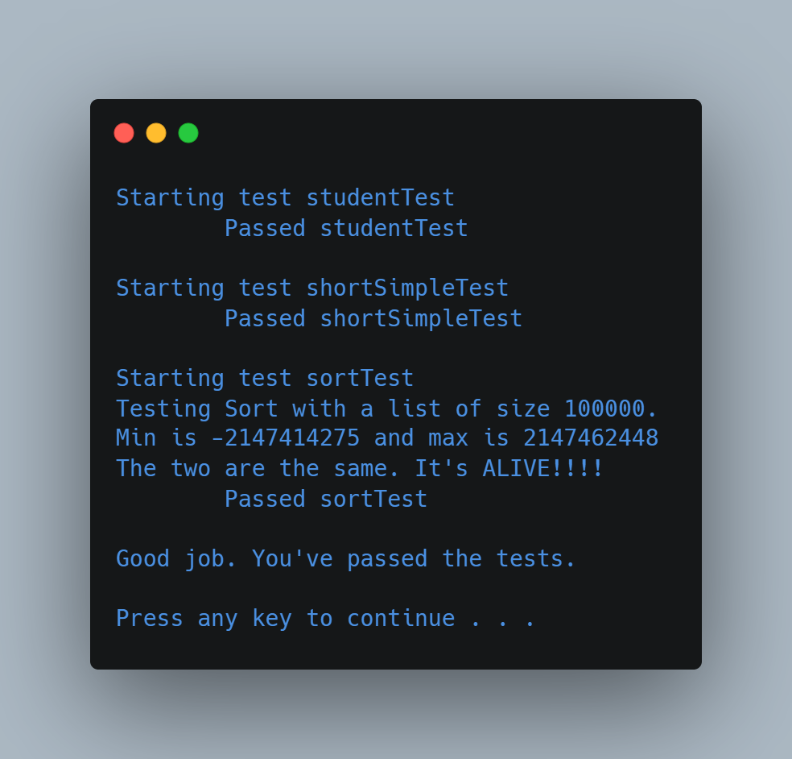

# Heapsort Algorithm Implementation

Data Structures

(FSC-BCS-370-Mod12)

## Output

## Assignment Context

This project was assigned as an exercise to fundamentally understand how the Heapsort Algorithm functions.

The repository contains files provided by the professor, including incomplete code for methods, and test code to check for the proper functionality of said methods.

The goal of the assignment was to complete the code, create a template version, and pass the tests to prove comprehension.

This project was written in C++ using Visual Studio 2019

## Features

This is a C++ implementation of the Heapsort Algorithm. 

The header file is split into two parts, one for a non-templated implementation of the queue, and one for a templated implementation. 
The header file also includes a definition for the statusCode enum, which is used to indicate the success or failure of various queue operations, and some constants used by the implementation.

### Methods
- maxHeapify()
- heapsort()

## How It Works

There is a C++ header file that defines a function for heap-sorting an array. 
The header contains both a non-templated and a templated version of the heapsort function.
The non-templated version takes an array of strings and its length, while the templated version can be used with arrays of any type.

The heapsort algorithm is a comparison-based sorting algorithm that divides the input into a sorted and an unsorted region, and iteratively shrinks the unsorted region by extracting the largest element and moving that to the sorted region. 
It works by creating a binary heap from the array and repeatedly extracting the maximum element from it.

The templated heapsort implementation uses a helper function called maxHeapify that takes an array, its length, and the index of an out-of-order element. 
The function works by first finding the largest element among the out-of-order element, its left child (if it exists), and its right child (if it exists). 
If the largest element is not the out-of-order element, the function swaps the two and calls itself recursively on the new position of the out-of-order element until the heap property is restored.

The heapsort function itself starts by converting the input array into a binary heap using maxHeapify, then repeatedly extracts the maximum element from the heap and puts it at the end of the heap array. 
Finally, it calls maxHeapify on the remaining heap to restore the heap property.

## Tests

### shortSimpleTest()

The shortSimpleTest function tests the heapsort function on two arrays, one of strings and one of integers. 
It first creates a vector and an array of strings, and checks to make sure that they are identical. 
It then sorts the array using the heapsort function and sorts the vector using the built-in std::sort function, and checks to make sure that the two sorted containers are identical. 
It then does the same thing with an array of integers.

### sortTest()

The sortTest function tests the heapsort function on a large array of randomly generated strings. 
It creates a vector of strings and an array of strings, both of size BIG_SIZE (which is 100000 in this case). 
It fills both the vector and array with randomly generated strings, and then sorts the vector using the built-in std::sort function, and sorts the array using the heapsort function. 
It then checks to make sure that the two sorted containers are identical.
